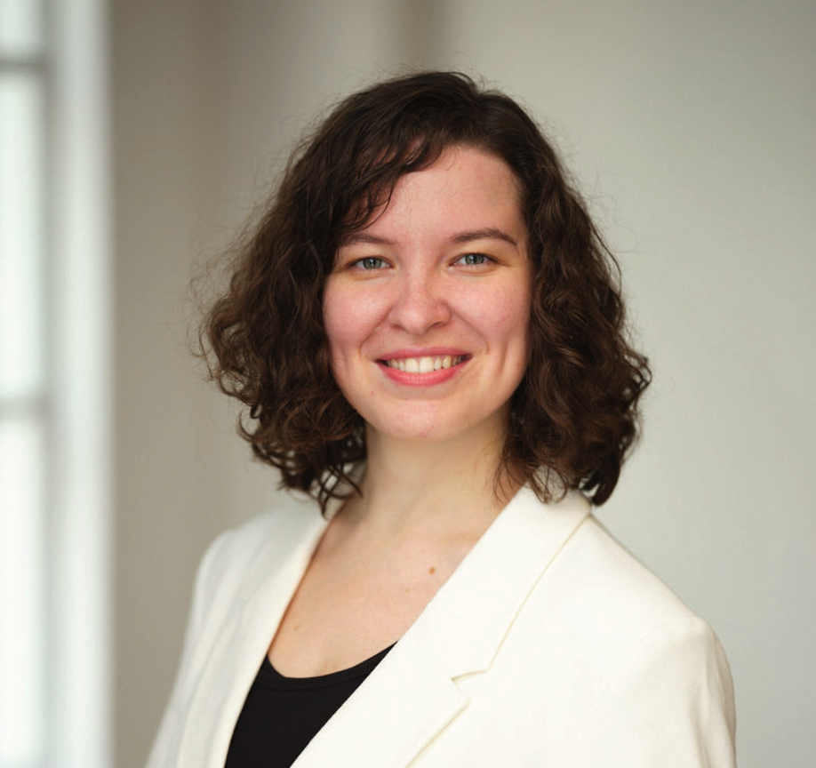

---

layout: default
title: Evgeniia Golovina - CV

---

## Evgeniia Golovina

A Postdoctoral Fellow at the Liggins Institute, University of Auckland, New Zealand.

Arkady and Boris Strugatsky, the greatest Russian science fiction masters, once wrote in “Monday Starts on Saturday” that the goal of science is human happiness. I agree. I’m passionate about science, and I have the same goal in mind - I want to be useful and make my small contribution to solving global health problems and making people at least a little happier. To discover this secret of happiness, I want to understand where it comes from and how to attain it for our society. I think it comes from me, from you, from our compassion, our courage, and our intentions to help people solve their problems. How to help people solve their problems is a difficult question, it's a challenge. Do you like challenges? I like too.

Contact me via Linkedin or email.

&nbsp;

**Summary:**

- NGS and multi-omics data analysis, 7 years
- Broad knowledge in health science, genetics, molecular biology and biochemistry
- Programming experience in R, Python, Matlab, C++, Bash
- Excellent organisational, writing, communication and presentation skills
- High motivation to get things done
- Ability to work in team and independently

**Contact information:**

- Email: Jn.Golovina@gmail.com, e.golovina@auckland.ac.nz
- Linkedin: [https://www.linkedin.com/in/evgeniiagolovina/](https://www.linkedin.com/in/evgeniiagolovina/)
- Github: [https://github.com/Eugeniia](https://github.com/Eugeniia)
- Twitter: [https://twitter.com/FoffaJn](https://twitter.com/FoffaJn)
- ResearchGate: [https://www.researchgate.net/profile/Evgeniia_Golovina2](https://www.researchgate.net/profile/Evgeniia_Golovina2)
- Google Scholar: [https://scholar.google.ru/citations?user=cR7t9_8AAAAJ&hl=en&authuser=1](https://scholar.google.ru/citations?user=cR7t9_8AAAAJ&hl=en&authuser=1)
- Publons: [https://publons.com/researcher/4650922/evgeniia-golovina/](https://publons.com/researcher/4650922/evgeniia-golovina/)

&nbsp;

### EDUCATION

**2017 &ndash; 2021** 
**PhD**. *University of Auckland, Liggins Institute, Health Sciences* 
Thesis “[Decoding the regulatory landscape of psychiatric and alcohol use
disorders](https://hdl.handle.net/2292/57161)” 

**2012 &ndash; 2014** 
**MSc**. *Saint Petersburg State University, Biology* 
Specialization: Biochemistry and Molecular Biology 
Thesis “Improvement of information value of spectroscopic data in the analysis of biodeteriorations” 

**2012 &ndash; 2014** 
**Professional Communication Translator**. *Saint Petersburg State University, English & Russian* 
Diploma work in translation of “Raman Spectroscopy in Art and Archaeology: A New Light on Historical Mysteries” (chapter 5 of the book “Frontiers of Molecular Spectroscopy”) (Oxford, Elsevier, 2009, pp.133-164) 

**2008 &ndash; 2012** 
**BSc**. *Saint Petersburg State University, Biology* 
Specialization: Cell and Molecular Biology, Biotechnology 
Thesis “Diagnostics and genotyping of viral hepatitis C in Saint Petersburg and Leningrad region in 2010-2011” 

&nbsp;

### PROFESSIONAL & RESEARCH EXPERIENCE

<strong>11.10.2021 &mdash; present</strong> 
<strong>[Liggins Institute](https://www.auckland.ac.nz/en/liggins.html)</strong>, Auckland, New Zealand 
Position: Postdoctoral Fellow 

Developing a Machine Learning approach to predict an individual’s predisposition to chronic obstructive pulmonary disease and co-occuring traits. Co-supervising three PhD students.

&nbsp;

<strong>13.06.2022 &mdash; 18.07.2022</strong> 
<strong>[Talent Solutions](https://talentsolutions.co.nz/)</strong>, Auckland, New Zealand 
Position: UoA Micro-internship Mentor 

Supported three teams of students by guiding them, providing constructive and timely feedback, and helping them gain real-world industry experience (i.e. teamwork, SWOT and SEO analyses, preparation and delivery of the final report/presentation to the client) with leading New Zealand organizations.

&nbsp;

<strong>09.11.2021 &mdash; 17.12.2021</strong> 
<strong>[Talent Solutions](https://talentsolutions.co.nz/)</strong>, Auckland, New Zealand 
Position: UoA Micro-internship Mentor 

Supported two teams of students by guiding them, providing constructive and timely feedback, and helping them gain real-world industry experience (i.e. teamwork, market research, preparation and delivery of the final report/presentation to the client) with leading New Zealand organizations.

&nbsp;

<strong>01.04.2021 &mdash; 11.10.2021</strong> 
<strong>[Liggins Institute](https://www.auckland.ac.nz/en/liggins.html)</strong>, Auckland, New Zealand 
Position: Research Assistant 

Performed multi-omics integrative data analysis to identify the spatial regulatory gene network of chronic obstructive pulmonary disease and co-occuring traits.

&nbsp;

<strong>10.12.2013 &mdash; 25.08.2017</strong> 
<strong>[Genestack](https://genestack.com/)</strong>, Saint Petersburg, Russia 
Position: Biologist 

Performed Next-Generation Sequencing analysis of different types of data (RNAseq, WGS, WES, WGBS, RRBS, single-cell RNA-seq, microarray, ChIP-seq, DNase-seq, microbiome). Developed a test system for biological applications. Curated experiments pre-uploaded from public databases. Helped software developers create user-friendly interfaces. Promoted the company products. Supported users.

&nbsp;

<strong>01.02.2013 &mdash; 26.09.2013</strong> 
<strong>Nevinpat</strong>, Saint Petersburg, Russia 
Position: Patent agent 

Protected foreign applications coming from Russian and Eurasian patent offices. Facilitated correspondence between patent experts and foreign applicants. Performed comparative analysis of patentability. Edited Russian translations of patent applications. Defined patent infringement.

&nbsp;

<strong>01.12.2010 &mdash; 29.06.2012</strong> 
<strong>[Smorodintsev Research Institute of Influenza](https://influenza.spb.ru/en/about_institute/institute_today/)</strong>, Saint Petersburg, Russia 
Position: Research Assistant 

Performed laboratory diagnosis of hepatitis C, torque teno, and influenza viruses.

&nbsp;

### SKILLS & INTERESTS

**Personal qualities:**
Self-starter on exploratory projects, goal-driven, scientific curiosity, highly interested in getting things done, excellent organizational and communication skills, eager to learn and develop new skills, willing to travel up to 80%

**Data analysis and computer skills:**
Expertise with commonly used software applications and bioinformatics tools for analysis of multi-omics and spectroscopic data; experience with NeSI, Nectar Research Cloud, eResearch VMs and Google Cloud computing platforms; familiarity with container platforms (Docker, Singularity), database administration tools (PostgreSQL), version control tools (Git), Adobe tools (Illustrator, Photoshop, XD), integrated development environments (Spyder, PyCharm, RStudio),
visualization tools (Tableau and Microsoft Power BI), machine learning frameworks (PyTorch, TensorFlow 2)

**Programming skills:**
Python, R, MatLab, C++, Bash

**Languages:**
Russian (native), English (professional), Spanish (limited), German (elementary)

**Professional interests:**
Health sciences, bioinformatics, data science, data visualization, public speaking, machine learning, 4D genome architecture, gene regulation, scientific communication, neurogenetics, psychology, precision medicine, innovation and commercialization in science

**Hobbies:**
Hiking, yoga, art, sports massage, scuba diving and freediving, first aid

&nbsp;

### ACTIVITIES / PRESENTATIONS
- **Liggins seminar** (oral presentation), Auckland, NZ, 17th of August, 2021 
- **15th GeneMappers Conference 2021** (oral presentation), 23-25 June 2021 
- **IET #PresentIn10 Competition** (Healthy lives, Stage 1 winner), 23 June 2021 
- **Virtual Keystone Symposia "Neuroimmune Interactions in Health and Disease"** (digital poster), 7-9 June 2021 
- Instructor at the **virtual workshop** [**"Using R in Research"**](https://tayaza.github.io/2021-05-18-ihvn-online/) organised by the Liggins Institue in collaboration with the Institute of Human Virology in Nigeria (IHVN), 17-18 May 2021 
- **Virtual EMBL Conference: From Functional Genomics to Systems Biology** (digital poster), 16-19
November 2020 
- **16th Asian Conference on Transcription 2019** (poster presentation), 1-4 December 2019, Dunedin, NZ 
- **Liggins Institute public lecture** “Precision medicine: your genes and mental health”, 26th November 2019, Auckland, NZ. Available [here](https://www.youtube.com/watch?v=ZdHQQR4Y_vU&feature=emb_logo%2F) 
- **Queenstown Research Week 2019** (oral presentation), 31 August - 6 September 2019, Queenstown, NZ 
- **HealtheX 2019 conference** (oral presentation), 13th September 2019, Auckland, NZ 
- **The Research Bazaar (ResBaz) 2019**, helper for “Introductory R” session, 10-12 July 2019, Auckland, NZ 
- **HealtheX 2018 conference** (elevator pitch presentation), 7th September 2018, Auckland, NZ 

&nbsp;

### PUBLICATIONS

- Farrow S, Schierding W, Gokuladhas S, **Golovina E**, Fadason T, Cooper AA, O’Sullivan JM. Establishing gene regulatory networks from Parkinson's disease risk loci. Brain. 2022.  [DOI](https://doi.org/10.1093/brain/awac022)
- Fadason T, Farrow S, Gokuladhas S, **Golovina E**, Nyaga D, O'Sullivan JM, Schierding W. Assigning function to SNPs: Considerations when interpreting genetic variation. Semin Cell Dev Biol. 2021. [DOI](https://doi.org/10.1016/j.semcdb.2021.08.008)
- Gokuladhas S, Schierding W, **Golovina E**, Fadason T, O’Sullivan JM. Unravelling the shared genetic mechanisms underlying 18 autoimmune diseases using a systems approach. Front Immunol. 2021;12:3262. [DOI](https://doi.org/10.3389/fimmu.2021.693142)
- **Golovina E**, Fadason T, Lints T, Walker C, Vickers MH, O'Sullivan JM. Understanding the impact of SNPs associated with autism spectrum disorder on biological pathways in the human fetal and adult cortex. Sci Rep. 2021;11:15867. [DOI](https://doi.org/10.1038/s41598-021-95447-z)
- **Golovina E**, Vickers MH, Erb CD, O’Sullivan JM. GWAS SNPs impact shared regulatory pathways amongst multimorbid psychiatric disorders and cognitive functioning. Front Psychiatry. 2020;11:1079. [DOI](https://www.frontiersin.org/articles/10.3389/fpsyt.2020.560751/full)
- Hibberd R, **Golovina E**, Farrow S, O’Sullivan JM. Genetic variants associated with alcohol dependence coordinate regulation of ADH genes in gastrointestinal and adipose tissues. Sci Rep. 2020;10:1-10. [DOI](https://www.nature.com/articles/s41598-020-66048-z)
- Fadason T, Gokuladhas S, **Golovina E**, Ho D, Farrow S, Nyaga D, et al. A transcription regulatory network within the ACE2 locus may promote a pro-viral environment for SARS-CoV-2 by modulating expression of host factors. bioRxiv. 2020:2020.04.14.042002. [DOI](https://www.biorxiv.org/content/10.1101/2020.04.14.042002v2)

&nbsp;

### VOLUNTEER EXPERIENCE

<strong>01.04.2021 &mdash; present</strong> 
<strong>[English Language Partners](https://www.englishlanguage.org.nz/)</strong>, Auckland, New Zealand 
Role: Job Mentor 

Helping improve communication between New Zealand employers and new migrant employees (Worktalk and F2F English for Employees programs).

&nbsp;

<strong>01.09.2021 &mdash; present</strong> 
<strong>[The University of Auckland English Language Academy](https://www.ela.auckland.ac.nz/)</strong>, Auckland, New Zealand 
Role: Conversation Leader 

Helping ELA students to engage in meaningful conversations outside of their English classes by creating a comfortable group environment, encouraging equal participation, promoting tolerance to cultural differences and making sure all participants can follow the conversation (Meet2Chat program).

&nbsp;

<strong>09.03.2022 &mdash; present</strong> 
<strong>[The University of Auckland Business School](https://www.auckland.ac.nz/en/business.html)</strong>, Auckland, New Zealand 
Role: Business Mentor 

Supporting business students (Women’s Mentoring Programme).

&nbsp;

<strong>01.09.2021 &mdash; present</strong> 
<strong>[The University of Auckland Book Club](https://www.auckland.ac.nz/en/alumni/get-involved/virtual-book-club.html)</strong>, Auckland, New Zealand 
Role: Discussion Leader 

Sharing my passion for reading through creating an engaging and thoughtful community where members can feel comfortable and welcome participating in the discussions of book selections that span different genres and topics.

&nbsp;

<strong>01.10.2021 &mdash; present</strong> 
<strong>[GoodSAM](https://www.goodsamapp.org/)</strong>, New Zealand 
Role: GoodSAM Responder 

Ready to respond to and help a patient suspected to be in cardiac arrest.

&nbsp;

### ADDITIONAL EDUCATION
- [Virtual U21 Early Career Researcher Workshop on Planetary Health](https://ghum.kuleuven.be/phd/u21-early-career-research-workshop-on-planetary-health) by Universitas 21, 21-25 February 2022
- [Certified Carpentries Instructor](https://www.dropbox.com/s/mh0beqdxfykn4te/homemaneeshaDocumentsjobscarpentriescarpentries_reposcertificationdc-instructorgolovina_evgeniia.pdf?dl=0) by [The Carpentries](https://carpentries.org/), 12th January 2022
- [Virtual Leadership Development Course "Universitas 21 Global Citizenship"](https://universitas21.com/globalcitizens) by Universitas 21 & Common
Purpose, 4-27 October 2021
- [Healthy Conversation Skills Course](https://www.dropbox.com/s/i12dj5t4rmzfqv3/Certificate_Healthy_Conversation.pdf?dl=0) by Healthy Start Professional Development
- [Healthy Start Workforce Online Education Programme](https://www.dropbox.com/s/0q4vi7swc0qpxme/Early-life%20Science%20Programme_Healthy%20Start%20Education%20Programme%20Certificate%20of%20Completion.pdf?dl=0) by Healthy Start Professional Development
- [Docker Masterclass for Machine Learning and Data Science](https://www.udemy.com/certificate/UC-c2ac9cbc-46c0-4312-8271-6fb7727c991c/) (Udemy)
- [Psychological First Aid](http://coursera.org/verify/PPJQDEAVY5AK) by Johns Hopkins University (Coursera)
- [Comprehensive First Aid Course](https://www.dropbox.com/s/lyxgfdbcp8l5c7d/Certificate_Comprehensive_First_Aid_AM_Doc_b21177c8-3213-4fe3-b2bc-36eeccdb57c5.pdf?dl=0) by New Zealand Red Cross
- [Mental Health First Aid Course](https://www.dropbox.com/s/ngabk625cvpdoec/Mental_health_first_aid_Evgeniia_Golovina_508510_1692112.PDF?dl=0) by St John New Zealand
- [Executive Data Science Specialization](https://www.coursera.org/account/accomplishments/specialization/ZLV6XLYVN9PZ) by Johns Hopkins University (Coursera)
- Data Science Specialization by Johns Hopkins University (Coursera)
- Machine Learning A-Z™: Hands-On Python & R In Data Science (Udemy)
- [Power BI A-Z: Hands-On Power BI Training For Data Science](https://www.dropbox.com/s/cn0jy8a872z90yh/Udemy_Power_BI_A-Z_Hands-On_Power_BI_Training_For_Data_Science.pdf?dl=0) (Udemy)
- [Tableau A-Z: Hands-On Tableau Training for Data Science](https://www.dropbox.com/s/jevzuzqbi9exrvs/Udemy_Tableau_2020_A-Z_Hands-On_Tableau_Training_for_Data_Science.pdf?dl=0) (Udemy)
- [Grow Your Impact as a Mentor](https://www.dropbox.com/s/jtw44wv4le0zblf/CertificateOfCompletion_Grow_Your_Impact_as_a_Mentor_learning_path.pdf?dl=0) (Linkedin Learning)
- [Diversity, Inclusion, and Belonging for Leaders and Managers](https://www.dropbox.com/s/4b1j18fjqirodi3/CertificateOfCompletion_Diversity_Inclusion_and_Belonging_for_Leaders_and_Managers.pdf?dl=0) (Linkedin Learning)
- **Virtual BCI & Neurotechnology Spring School** by g.tec medical engineering GmbH, 12-21 April 2021
- **Hi-C workshop** by Genomics Aotearoa, 25-26 March 2021, Auckland, NZ
- Co-organizer of the **Student Research Day at Liggins Institute**, 1st December 2020, Auckland, NZ
- **Winter School in Mathematical & Computational Biology** by the University of Queensland, 2-6 July 2018, Brisbane, Australia
- **Enterprise & Innovation Workshop** by Centre for Innovation and Entrepreneurship at the University of Auckland, 7 & 13 March 2018, Auckland, NZ
- **PhD Research Innovation & Commercialisation Course** by Centre for Innovation and Entrepreneurship at the University of Auckland, 9-10 November 2017, Auckland, NZ

&nbsp;

### REFEREES

- **Prof. Justin O’Sullivan**, *Liggins Institute, University of Auckland*, email: justin.osullivan@auckland.ac.nz
- **MBA, PhD. Alessandro Riccombeni**, *Amazon Web Services*, email: alessandro.riccombeni@gmail.com
- **Sarah Clifton**, *The University of Auckland English Language Academy*, email: sarah.clifton@auckland.ac.nz
- **Prof Emer. John Werry**, *University of Auckland*, email: j.werry@auckland.ac.nz
- **Prof. Lyudmila Panina**, *Saint Petersburg State University*, email: lkpanina@yandex.ru

<i>Best printed with Google Chrome</i>

